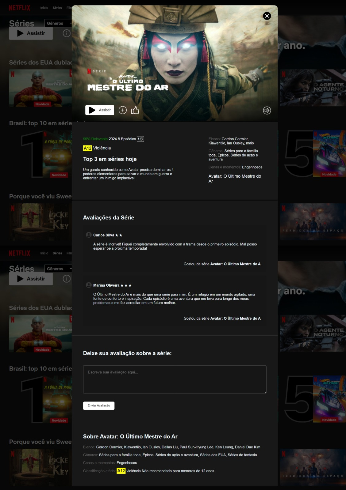

## Descrição

Este é um projeto de modelo de página para exibição de informações sobre uma série de TV chamada "Avatar: O Último Mestre do Ar". O projeto inclui detalhes sobre a série, como elenco, gêneros, classificação etária e avaliações dos usuários.

## Estrutura do Projeto

O projeto consiste em um arquivo HTML (`ModeloSerie.html`) e um arquivo CSS (`styleModeloSerie.css`). O HTML contém a estrutura da página, enquanto o CSS fornece os estilos de design.

## Pré-visualização

Aqui está uma pré-visualização da página:



## Como Utilizar

1. Clone o repositório para o seu computador:

   ```bash
   git clone https://github.com/seu-usuario/nome-do-repositorio.git
